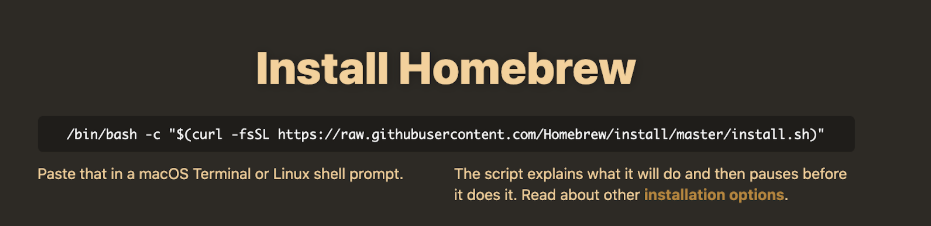
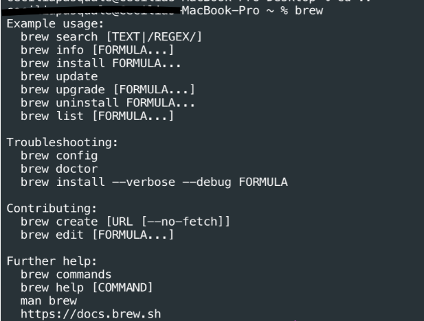
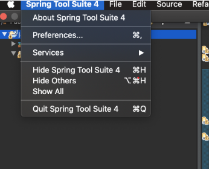

# Mac Java Environment Setup Guide

## Install Using A Package Manager

A *package manager* is a command line tool that allows you to install and manage software. You can use a package manager to install all of the software listed here.

The package manager that we'll be using for this guide is called Homebrew. It's a command-line installer for MacOS, which means that you'll have to be running a macOS in order to use. The examples provided here are utilizing macvscodeOS Catalina version 10.15.5.

## Step 1: Install Homebrew




Open your terminal and run `/bin/bash -c "$(curl -fsSL https://raw.githubusercontent.com/Homebrew/install/HEAD/install.sh)"`

Then run `brew`.

The result should look like the following:



## Step 2: Install Git

With Homebrew installed, you are now ready to install Git. Open a terminal window and enter <code>brew install git</code>

To verify that Git is installed on your system, type <code>git --version</code>

## Step 3: Install JDK 8

In your terminal run: <code>brew install adoptopenjdk/openjdk/adoptopenjdk8</code>


### Configure your Environment Variables
#### A. Mac OSX 10.5 or later:
In Mac OSX 10.5 or later, Apple recommends to set the <code>$JAVA_HOME</code> variable to <code>/usr/libexec/java_home</code>, just export <code>$JAVA_HOME</code> in file <code>~/. bash_profile</code> or ~<code>/.profile</code>.

```code
# This will open up a text editor called vim
$ vim .bash_profile

# Inside the text editor, write this
export JAVA_HOME=$(/usr/libexec/java_home)

# To quit vim and save your changes:
# 1. press the ESC key
# 2. You should see the ––INSERT–– label vanish from the lower-left.
# 3. To save your changes before you exit, type :w , and then Enter. This will save any changes made. 
#       Vim will respond by outputting the filename, whether it’s new, and how many characters were written to the hard drive.

# Next, execute the file you created
$ source .bash_profile

# Confirm that the path variable has been set
$ echo $JAVA_HOME
/Library/Java/JavaVirtualMachines/1.8.0.jdk/Contents/Home
```

#### B. Older Mac OSX:
For older Mac OSX, the <code>/usr/libexec/java_home</code> doesn’t exist, so, you should set <code>JAVA_HOME</code> to the fixed path:

```code
$ vim .bash_profile

export JAVA_HOME=/System/Library/Java/JavaVirtualMachines/1.8.0.jdk/Contents/Home

$ source .bash_profile

$ echo $JAVA_HOME
/System/Library/Java/JavaVirtualMachines/1.8.0.jdk/Contents/Home
```


## Step 4:  Install Spring Tool Suite 4

Navigate to https://spring.io/tools and download the appropriate version of Spring Tool.

If your installation was successful, you should now be able to search for <code>Spring Tool Suite</code> in your spotlight search using <code>cmd+space</code>.

Once downloaded, open Spring Tool and navigate to your preferences. 



1. Navigate to the [IntelliJ Community](https://www.jetbrains.com/idea/download/#section=mac) website and download the Community Edition executable. 


2. Once the download has finished go to your downloads folder, search for the downloaded executable and double click it to begin the install process.


## Step 5: Install Maven

To install **Maven** with Homebrew, open your terminal window and run: <code>brew install maven</code> 

Once the download is complete, verify the installation by running: <code>mvn -v</code>

## Step 6: Install DBeaver

Navigate to https://dbeaver.io/download/ and download the appropriate version of DBeaver.

If your installation was successful, you should now be able to search for "dbeaver" in your spotlight with <code>cmd + space</code>.

## Step 7: Install Apache Tomcat 8
Follow these [instructions](https://medium.com/@jeongwhanchoi/how-to-install-apache-tomcat-on-mac-os-x-605b1cb55252).  The author has downloaded Apache Tomcat 9.  You will download Apache Tomcat **8** and follow the exact same steps and terminal commands.

## Step 8: Install Postman

The following is the single command required to install Postman on macOS using Homebrew:

<code>brew cask install postman</code>


